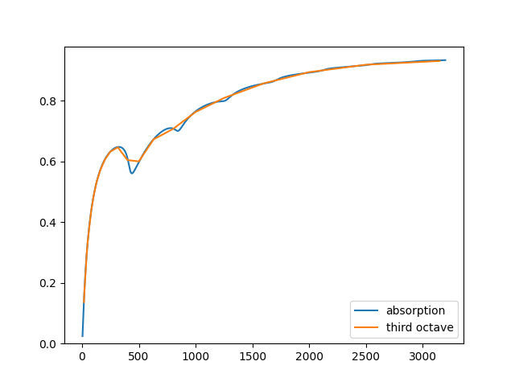
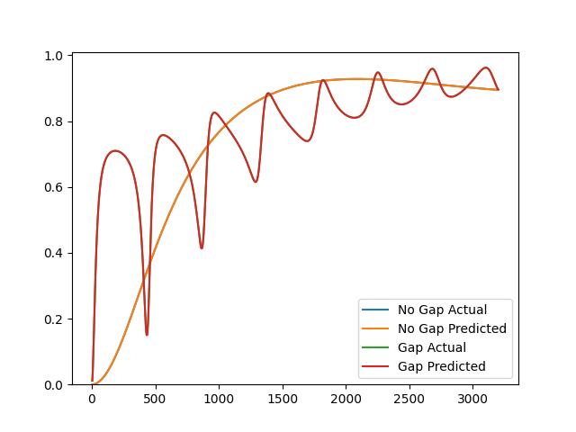

[](https://squidfunk.github.io/mkdocs-material/)


<!-- [](https://github.com/jakep72/acoustipy/actions/workflows/testing.yml) -->
<!-- [](https://github.com/jakep72/acoustipy/actions/workflows/python-publish.yml) -->
<!-- [](https://github.com/jakep72/acoustipy/actions/workflows/build_docs.yml) -->


# acoustipy

Investigate and optimize the acoustic performance of porous and microperforate materials with acoustipy.  Use the acoustic transfer matrix method to explore new material designs and identify unique properties of existing materials via inverse, indirect, and hybrid optimization schemes.
<br></br>

# Installation

### Create and activate a new virtual environment (recommended)
    mkdir <your_env_name>
    python -m venv .venv
    cd .venv
    (Windows) cd Scripts && activate.bat
    (Linux) source bin/activate

### Install from source
    git clone https://github.com/jakep72/acoustipy.git
    cd acoustipy
    pip install -e .
    pip install -r requirements.txt

### Install from PyPI
    pip install acoustipy

# Basic Usage
Examples of most of the functionality of acoustipy can be found in the Examples section of the [documentation](https://jakep72.github.io/acoustipy/).  The snippet below corresponds to the multilayer structure example and highlights a core feature of acoustipy -- the acoustic transfer matrix method.
<br></br>

```Python
from acoustipy import acousticTMM

# Create an AcousticTMM object, specifying a diffuse sound field at 20C
structure = AcousticTMM(incidence='Diffuse',air_temperature=20)

# Define the layers of the material using various models
layer1 = structure.Add_Resistive_Screen(thickness=1,flow_resistivity=100000,porosity=.86)
layer2 = structure.Add_DBM_Layer(thickness = 25.4,flow_resistivity=60000)
layer3 = structure.Add_Resistive_Screen(thickness = 1, flow_resistivity=500000,porosity=.75)

# Specify the material backing condition -- in this case a 400mm air gap
air = structure.Add_Air_Layer(thickness = 400)

# Build the total transfer matrix of the structure + air gap
transfer_matrix = structure.assemble_structure(layer1,layer2,layer3,air)

# Calculate the frequency dependent narrow band absorption coefficients
absorption = structure.absorption(transfer_matrix)

# Calculate the 3rd octave bands absorption coefficients
bands = structure.octave_bands(absorption)

# Calculate the four frequency average absorption
FFA = structure.FFA(bands)

# Plot and display the narrow and 3rd band coefficients on the same figure
structure.plot_curve([absorption,bands],["absorption","third octave"])
```

<br>



<br>
The example below demonstrates another core feature of acoustipy -- optimization routines that are able to identify the JCA model parameters of porous materials from impedance tube measurements.  The snippet can also be found under the Inverse Method in the Examples section.
<br></br>

```python
from acoustipy import acousticTMM, AcousticID

# Create an AcousticTMM object to generate toy impedance tube data
structure = acousticTMM(incidence='Normal',air_temperature = 20)

# Define the JCA and air gap material parameters for the toy data
layer1 = structure.Add_JCA_Layer(thickness = 30, flow_resistivity = 46879, porosity = .93, tortuosity = 1.7, viscous_characteristic_length = 80, thermal_characteristic_length = 105)
air = structure.Add_Air_Layer(thickness = 375)

#Generate rigid backed absorption data and save to a csv file
s1 = structure.assemble_structure(layer1)
A1 = structure.absorption(s1)
structure.to_csv('no_gap',A1)

# Generate air backed absorption data and save to a csv file
s2 = structure.assemble_structure(layer1,air)
A2 = structure.absorption(s2)
structure.to_csv('gap',A2)

# Create an AcousticID object, specifying to mount types, data files, and data types
inv = AcousticID(mount_type='Dual',no_gap_file="no_gap.csv", gap_file = 'gap.csv',air_temperature=20,input_type='absorption')

# Call the Inverse method to find the tortuosity, viscous, and thermal characteristic lengths of the material
res = inv.Inverse(30, 47000,.926,air_gap=375,uncertainty=.2,verbose=True)

# Display summary statistics about the optimization
stats = inv.stats(res)
print(stats)

# Plot the results of the found parameters compared to the toy input data
inv.plot_comparison(res)

# Save the optimization results to a csv
inv.to_csv("params.csv",res)

stats = {'slope': 1.000037058594857, 'intercept': 9.276088883464206e-05, 'r_value': 0.9999999674493408, 'p_value': 0.0, 'std_err': 8.732362148426126e-06}
```

<br></br>



# References

#### [1] https://apmr.matelys.com/

#### [2] Jean‐F. Allard, Yvan Champoux; New empirical equations for sound propagation in rigid frame fibrous materials. J. Acoust. Soc. Am. 1 June 1992; 91 (6): 3346–3353. https://doi.org/10.1121/1.402824

#### [3] Miki, Y. (1990). Acoustical Properties of porous materials : Modifications of Delany-Bazley models. The Journal of The Acoustical Society of Japan (e), 11, 19-24.

#### [4] Yvan Champoux, Jean‐F. Allard; Dynamic tortuosity and bulk modulus in air‐saturated porous media. J. Appl. Phys. 15 August 1991; 70 (4): 1975–1979. https://doi.org/10.1063/1.349482

#### [5] Kirill V. Horoshenkov, Alistair Hurrell, Jean-Philippe Groby; A         three-parameter analytical model for the acoustical properties of porous media. J. Acoust. Soc. Am. 1 April 2019; 145 (4): 2512–2517. https://doi.org/10.1121/1.5098778

#### [6] François-Xavier Bécot, Luc Jaouen; An alternative Biot's formulation for dissipative porous media with skeleton deformation. J. Acoust. Soc. Am. 1 December 2013; 134 (6): 4801–4807. https://doi.org/10.1121/1.4826175

#### [7] Mathieu Gaborit, Olivier Dazel, Peter Göransson; A simplified model for thin acoustic screens. J. Acoust. Soc. Am. 1 July 2018; 144 (1): EL76–EL81. https://doi.org/10.1121/1.5047929

#### [8] Sarwono, Joko & Prasetiyo, Iwan & Andreas, S. & William, A.. (2014). The Design of MPP and its Application to Enhance the Acoustics of a Real Auditorium. 10.13140/RG.2.1.1766.0007.

#### [9] Jaouen, Luc & Bécot, François-Xavier. (2011). Acoustical characterization of perforated facings. The Journal of the Acoustical Society of America. 129. 1400-6. 10.1121/1.3552887.

#### [10] Hideo Utsuno, Toshimitsu Tanaka, Takeshi Fujikawa, A. F. Seybert; Transfer function method for measuring characteristic impedance and propagation constant of porous materials. J. Acoust. Soc. Am. 1 August 1989; 86 (2): 637–643. https://doi.org/10.1121/1.398241

#### [11] Atalla, Youssef & Panneton, R.. (2005). Inverse acoustical characterization of open cell porous media using impedance tube measurements. Canadian Acoustics - Acoustique Canadienne. 33. 

#### [12] Raymond Panneton, Yacoubou Salissou; Indirect acoustical characterization of sound absorbing materials.. J. Acoust. Soc. Am. 1 October 2009; 126 (4_Supplement): 2297. https://doi.org/10.1121/1.3249416