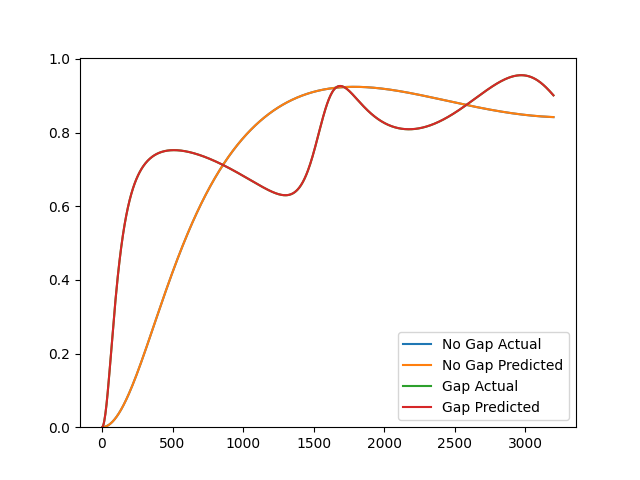

# Hybrid Characterization
Use a hybrid characterization method to identify parameters of the Johnson-Champoux-Allard model given data obtained from an impedance tube.

```python
from acoustipy import AcousticTMM, AcousticID

# Create an AcousticTMM object to generate toy impedance tube data
structure = AcousticTMM(incidence='Normal',air_temperature = 20)

# Define the JCA and air gap material parameters for the toy data
layer1 = structure.Add_JCA_Layer(30, 46182,.917,2.1,83,128)
air = structure.Add_Air_Layer(thickness = 100)

# Generate rigid backed reflection data and save to a csv file
s1 = structure.assemble_structure(layer1)
A1 = structure.reflection(s1)
structure.to_csv('no_gap',A1)

# Generate air backed reflection data and save to a csv file
s2 = structure.assemble_structure(layer1,air)
A2 = structure.reflection(s2)
structure.to_csv('gap',A2)

# Create an AcousticID object, specifying to mount types, data files, and data types
inv = AcousticID(mount_type='Dual',no_gap_file="no_gap.csv",gap_file = "gap.csv",input_type='reflection',air_temperature=20)

# Call the Hybrid method to find the tortuosity, viscous, and thermal characteristic lengths of the material
res = inv.Hybrid(30,.917,air_gap=95,uncertainty = .15)

# print the identified parameters
print(res)

# Plot the absorption curves using the actual parameters vs those identified from the Indirect method
inv.plot_comparison(res)

res >>> {'thickness': 29.982,
         'flow resistivity': 46209.81,
         'porosity': 0.918,
         'tortuosity': 2.103,
         'viscous characteristic length': 83.0,
         'thermal characteristic length': 128.0,
         'air gap': 100.0,
         'error': 1.3018228618069009e-17}
```

<br></br>

