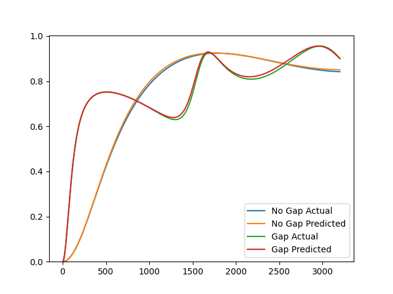

# Indirect Characterization
Use an indirect characterization method to identify parameters of the Johnson-Champaux-Allard model given data obtained from an impedance tube.

```python
from acoustipy import AcousticTMM, AcousticID

# Create an AcousticTMM object to generate toy impedance tube data
structure = AcousticTMM(incidence='Normal',air_temperature = 20)

# Define the JCA and air gap material parameters for the toy data
layer1 = structure.Add_JCA_Layer(30, 46182,.917,2.1,83,128)
air = structure.Add_Air_Layer(thickness = 100)

# Generate rigid backed reflection data and save to a csv file
s1 = structure.assemble_structure(layer1)
A1 = structure.reflection(s1)
structure.to_csv('no_gap',A1)

# Generate air backed reflection data and save to a csv file
s2 = structure.assemble_structure(layer1,air)
A2 = structure.reflection(s2)
structure.to_csv('gap',A2)

# Create an AcousticID object, specifying to mount types, data files, and data types
inv = AcousticID(mount_type='Dual',no_gap_file="no_gap.csv",gap_file = "gap.csv",air_temperature=20,input_type='reflection')

# Call the Indirect method to find the flow resistivity, tortuosity, and viscous, and thermal characteristic lengths of the material
res = inv.Indirect(30,.917,air_gap=100)

# Plot the absorption curves using the actual parameters vs those identified from the Indirect method
inv.plot_comparison(res)

# print the identified parameters
print(res)

res >> {'thickness': 30,
        'flow resistivity': 46182.79193470273, 
        'porosity': 0.9326784023844896,
        'tortuosity': 2.1373594528548225,
        'viscous characteristic length': 83.16500367154856,
        'thermal characteristic length': 115.12539138619321,
        'air gap': 100}

```

<br></br>

