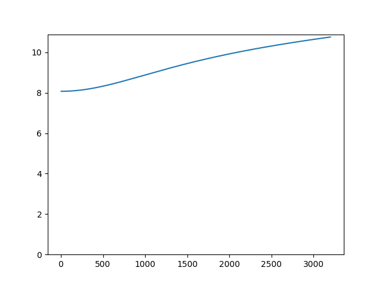

# Load layers from a database
Load the previously saved layers from the database and calculate the transmission loss
of one of the layers.

```python
from acoustipy import AcousticTMM

structure = AcousticTMM(incidence='Normal',air_temperature = 20)

# Add layers from the database
db = structure.Add_Layer_From_Database('test_DB')
dbm = structure.Add_Layer_From_Database('test_DBM')
jca = structure.Add_Layer_From_Database('test_JCA')
jcal = structure.Add_Layer_From_Database('test_JCAL')
jcapl = structure.Add_Layer_From_Database('test_JCAPL')
horoshenkov = structure.Add_Layer_From_Database('test_horoshenkov')
biot_limp = structure.Add_Layer_From_Database('test_biot_limp')
biot_rigid = structure.Add_Layer_From_Database('test2_biot_rigid')
screen = structure.Add_Layer_From_Database('test_screen')
maa = structure.Add_Layer_From_Database('test_maa_mpp')
ef_mpp = structure.Add_Layer_From_Database('test_ef_mpp')

# Calculate th narrow band transmission coefficients for the JCA layer
s = structure.assemble_structure(jca)
tl = structure.transmission_loss(s)

# Plot the transmission coefficients
structure.plot_curve([tl])
```
<br>

