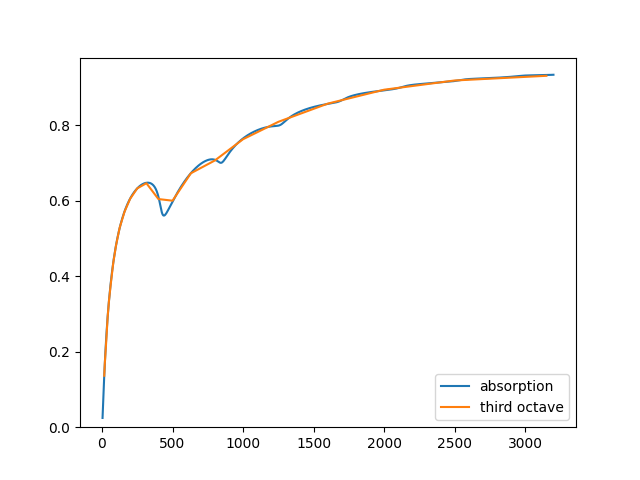

# Characterize a multilayer structure

Calculate the absorption coefficients of a multilayer structure and plot the narrow 
and 3rd octave bands using matplotlib.

```Python
from acoustipy import AcousticTMM

# Create an AcousticTMM object, specifying a diffuse sound field at 20C
structure = AcousticTMM(incidence='Diffuse',air_temperature=20)

# Define the layers of the material using various models
layer1 = structure.Add_Resistive_Screen(thickness=1,flow_resistivity=100000,porosity=.86)
layer2 = structure.Add_DBM_Layer(thickness = 25.4,flow_resistivity=60000)
layer3 = structure.Add_Resistive_Screen(thickness = 1, flow_resistivity=500000,porosity=.75)

# Specify the material backing condition -- in this case a 400mm air gap
air = structure.Add_Air_Layer(thickness = 400)

# Build the total transfer matrix of the structure + air gap
transfer_matrix = structure.assemble_structure(layer1,layer2,layer3,air)

# Calculate the frequency dependent narrow band absorption coefficients
absorption = structure.absorption(transfer_matrix)

# Calculate the 3rd octave bands absorption coefficients
bands = structure.octave_bands(absorption)

# Calculate the four frequency average absorption
FFA = structure.FFA(bands)

# Plot and display the narrow and 3rd band coefficients on the same figure
structure.plot_curve([absorption,bands],["absorption","third octave"])
```

<br>

