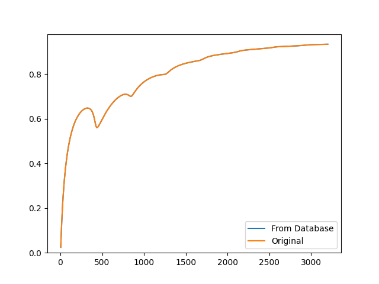

# Saving structures to a database
Save a structure consisting of mulitple layers to a built-in SQLite database

```python
from acoustipy import AcousticTMM, AcoustiBase

s = AcousticTMM(incidence='Diffuse',air_temperature=20)

# Define a arbitrary structure made of a porous DBM layer sandwhiched between 2 porous screens
layer1 = s.Add_Resistive_Screen(thickness=1,flow_resistivity=100000,porosity=.86,save_layer=True,layer_name='test_screen1')
layer2 = s.Add_DBM_Layer(thickness = 25.4,flow_resistivity=60000,save_layer=True,layer_name='test_DBM')
layer3 = s.Add_Resistive_Screen(thickness = 1, flow_resistivity=500000,porosity=.75,save_layer=True,layer_name='test_screen2')
air = s.Add_Air_Layer(thickness = 400,save_layer=True,layer_name='test_AIR')

# Save the structure to the database
structure = s.assemble_structure(layer1,layer2,layer3,air,save_structure=True,structure_name='test')

# Load the structure from the database
s2 = s.assemble_from_database('test')

# Compare the narrow band absorption curves from the original structure and the one loaded from the database
abs1 = s.absorption(structure)
absorption = s.absorption(s2)

s.plot_curve([absorption,abs1],['From Database','Original'])

# Pull the information from the database and save to .csv files
st = AcoustiBase()
st.summarize_layers()
st.summarize_structures()
```

<br>

