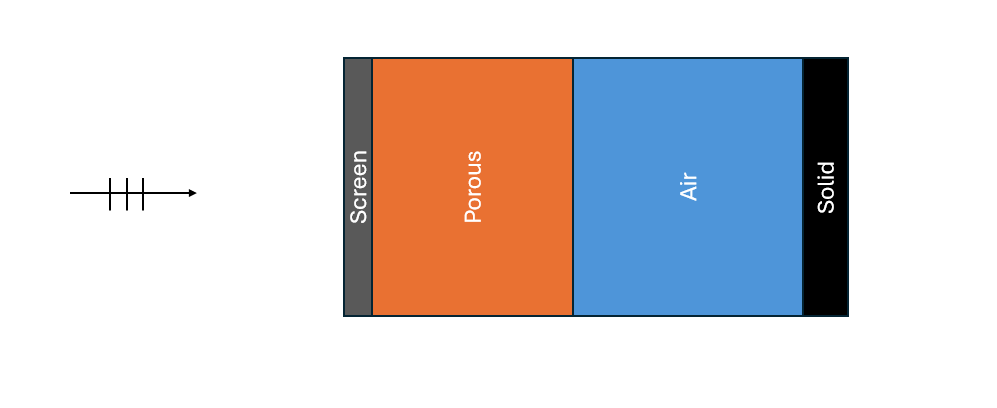

# Transfer Matrix Method

Three types of 2x2 transfer matrices are used to characterize porous materials $(T_{eq})$, air $(T_{air})$, and Maa microperforates $(T_{maa})$ in acoustipy.

The transfer matrices are also defined under 2 different sound field conditions -- normal and diffuse incidence.

### Normal Incidence Matrices

\[
T_{eq} = 
\begin{bmatrix}
\cos (k_{c}t) & jZ_{c}\sin(k_{c}t) \\
\frac{j}{Z_{c}}\sin(k_{c}t) & \cos (k_{c}t) \\
\end{bmatrix}
\]

\[
T_{air} = 
\begin{bmatrix}
\cos (k_{0}t) & jZ_{0}\sin(k_{0}t) \\
\frac{j}{Z_{0}}\sin(k_{0}t) & \cos (k_{0}t) \\
\end{bmatrix}
\]

\[
T_{maa} = 
\begin{bmatrix}
1 & Z_{c}\\
0 & 1 \\
\end{bmatrix}
\]

where $Z_{c}$ and $k_{c}$ are the characteristic impedence and wavenumber of the material calculated by the ADD_XXX_Layer methods implemented in acoustipy. $Z_{0}$ and $k_{0}$ are the characteristic impedence and wavenumber of air and are determined via:

\[
Z_{0} = \rho_{0} c_{0}
\]

\[
k_{0} = \frac{\omega}{c_{0}}    
\]

where $\rho_{0}$ is the density of air, $\omega$ is the angular frequency, and $c_{0}$ is the speed of sound in air.

### Diffuse Incidence Matrices

\[
T_{eq} = 
\begin{bmatrix}
\cos (k_{x}t) & j\frac{Z_{c} k_{c}}{k_{x}}\sin(k_{x}t) \\
j \frac{j k_{x}}{Z_{c} k_{c}}\sin(k_{x}t) & \cos (k_{x}t) \\
\end{bmatrix}
\]

\[
T_{air} = 
\begin{bmatrix}
\cos (k_{x}t) & j\frac{Z_{c} k_{0}}{k_{x}}\sin(k_{x}t) \\
j \frac{k_{x}}{Z_{c} k_{0}}\sin(k_{x}t) & \cos (k_{x}t) \\
\end{bmatrix}
\]

\[
T_{maa} = 
\begin{bmatrix}
1 & Z_{c}\cos(\theta)\\
0 & 1 \\
\end{bmatrix}
\]

where $k_{x}$ is:

\[
k_{x} = \sqrt{k_{c}-k_{0}\sin(\theta)}   
\]

and $\theta$ is the angle of incidence.

To obtain the total transfer matrix $(T_{t})$ of a multilayered structure, matrix multiplication is performed using the individual transfer matrices -- starting with the layer closest to the incident sound.

The illustration below is an example of a resistive screen on the face of a porous material, backed by a layer of air.

This is represented by:

\[
T_{t} = T_{screen} \times T_{porous} \times T_{air}    
\]